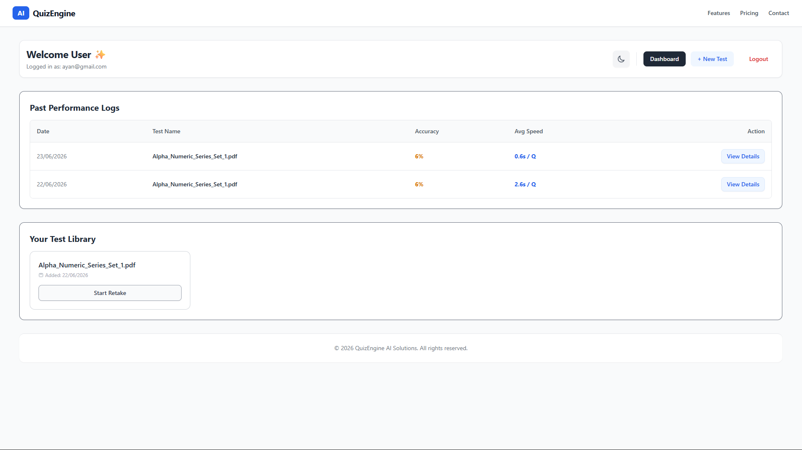
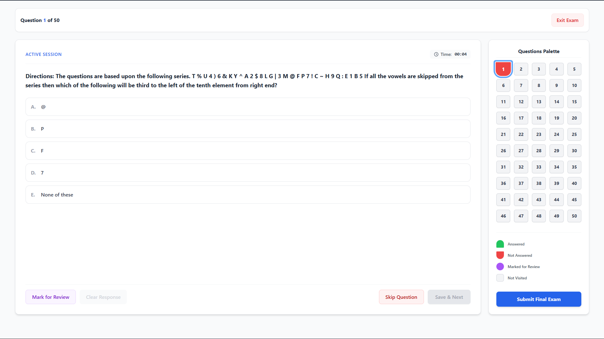
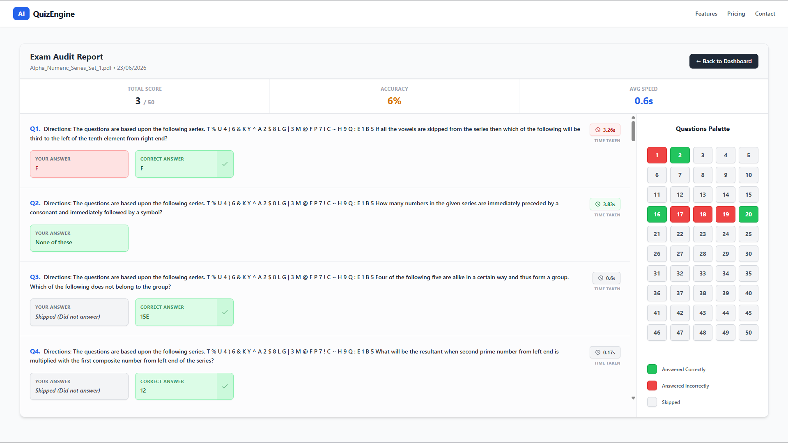
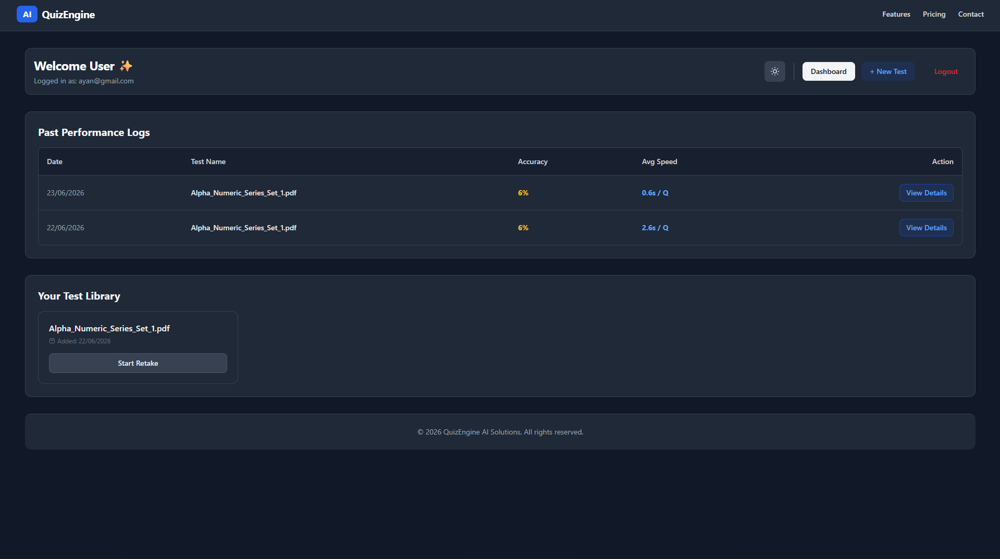

# 🚀 QuizEngine AI Solutions

> Transform static banking exam PDFs into interactive, AI-analyzed practice sessions.

QuizEngine is an intelligent platform built specifically for competitive banking aspirants such as **SBI PO**, **IBPS PO**, **RRB PO**, and other government exam candidates. It automates the process of converting traditional PDF question papers into fully functional, timed, and analytics-driven mock examinations.

---

## 🌟 Features

### ⚡ AI-Powered PDF-to-Exam Conversion

Upload any banking exam PDF and let the **Google Gemini AI** engine automatically extract:

* Questions
* Multiple-choice options
* Correct answers
* Exam structure

All within seconds.

### ⏱️ Real Exam Simulation

Experience an interface designed to replicate actual banking examinations.

Features include:

* Live countdown timer
* Question navigation panel
* Save & Next
* Mark for Review
* Skip Questions
* Instant submission

### 📊 Performance Analytics

Get a detailed analysis of your performance after every test.

Track:

* Correct & incorrect answers
* Time spent per question
* Topic-wise performance
* Accuracy percentage
* Areas needing improvement

### 📂 Personal Test Library

Maintain a digital archive of all your practice tests.

Benefits:

* Access previous attempts
* Compare performances
* Monitor long-term progress
* Revisit difficult questions

### 🌓 Dark Mode Support

Designed for comfortable studying during long sessions.

* Light Mode
* Dark Mode
* Responsive UI across devices

### 🔐 Secure Authentication

User data is protected using:

* JWT Authentication
* Protected Routes
* Secure Session Management

---

## 🛠️ Tech Stack

### Frontend

* React.js
* Tailwind CSS
* React Router DOM
* Vite

### Backend

* Node.js
* Express.js
* MongoDB
* Mongoose
* Multer
* PDF-Parse
* Google Gemini API

### Deployment

| Service  | Platform      |
| -------- | ------------- |
| Frontend | Vercel        |
| Backend  | Render        |
| Database | MongoDB Atlas |

---

## 🏗️ System Architecture

```text
PDF Upload
    │
    ▼
Multer Middleware
    │
    ▼
PDF-Parse
    │
    ▼
Google Gemini API
    │
    ▼
Structured Questions JSON
    │
    ▼
MongoDB Storage
    │
    ▼
React Exam Interface
    │
    ▼
Performance Analytics
```

---

## 🚀 Deployment Status

✅ Backend Deployed on Render

✅ Frontend Deployed on Vercel

✅ MongoDB Atlas Connected

---

## ⚙️ Local Development Setup

### Prerequisites

Ensure the following are installed:

* Node.js (v18+ recommended)
* npm
* MongoDB (Local or Atlas)

---

### 1️⃣ Clone the Repository

```bash
git clone https://github.com/ayanmp05/QuizEngine-frontend.git

cd QuizEngine-frontend
```

---

### 2️⃣ Backend Setup

```bash
cd backend

npm install
```

Create a `.env` file inside the backend directory:

```env
MONGO_URI=your_mongodb_connection_string

GEMINI_API_KEY=your_gemini_api_key

JWT_SECRET=your_jwt_secret
```

Start the backend server:

```bash
npm start
```

---

### 3️⃣ Frontend Setup

```bash
cd frontend

npm install

npm run dev
```

Update API endpoints if required to point to your local backend server.

---

## 📸 Screenshots

### Dashboard



### Mock Exam Interface



### Performance Analytics



### Dark Mode




---

## 📈 Future Enhancements

* AI-generated personalized study plans
* Difficulty-level prediction
* Leaderboard and rankings
* Question bookmarking
* Multi-language support
* Voice-assisted test navigation
* Mobile application support

---

## 🤝 Contributing

Contributions are welcome.

1. Fork the repository
2. Create a new feature branch

```bash
git checkout -b feature/amazing-feature
```

3. Commit your changes

```bash
git commit -m "Add amazing feature"
```

4. Push to your branch

```bash
git push origin feature/amazing-feature
```

5. Open a Pull Request

---

## 💡 About the Project

QuizEngine was created to bridge the gap between **static study materials** and **real examination practice**.

The goal is simple:

> Help banking aspirants spend less time managing study resources and more time improving their performance.

---

## 👨‍💻 Author

**Ayan Mahapatra**

* GitHub: https://github.com/ayanmp05
* Email: [ayanmahapatra4@gmail.com](mailto:ayanmahapatra4@gmail.com)

---

## ⭐ Support

If you found this project useful:

* Star the repository ⭐
* Share it with fellow aspirants 📚
* Contribute improvements 🚀

---

## 📝 License

This project is licensed under the MIT License.

Feel free to fork, modify, and improve it for educational and personal use.
